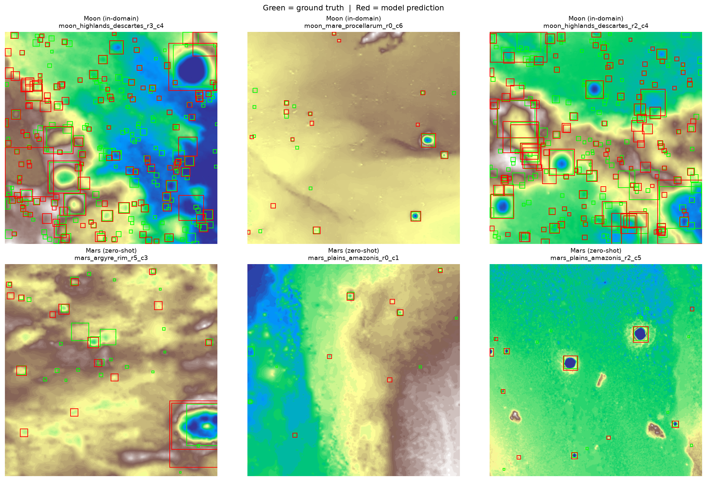
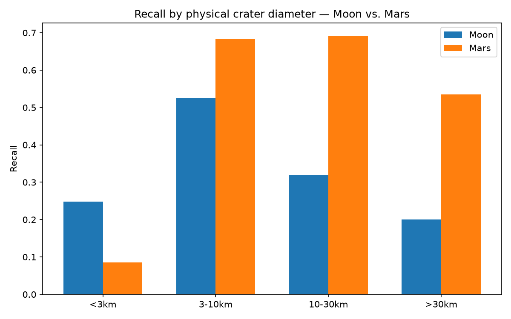
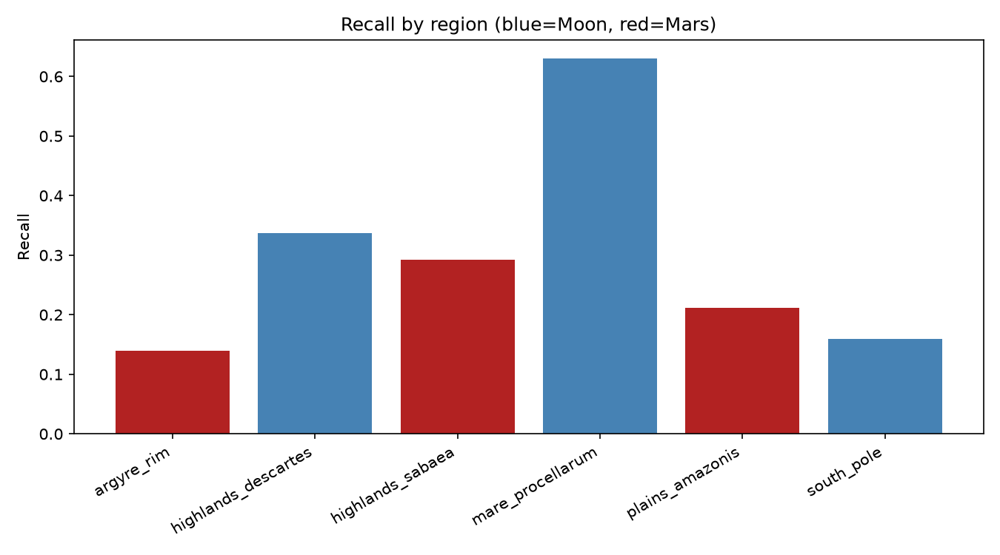
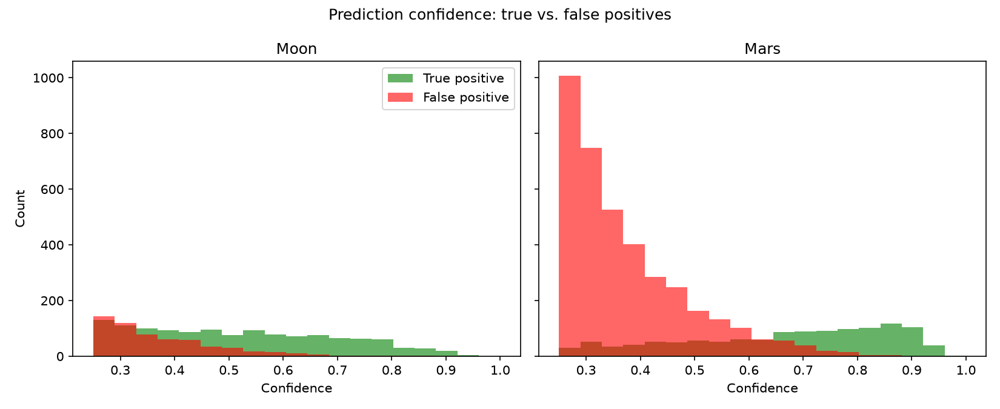
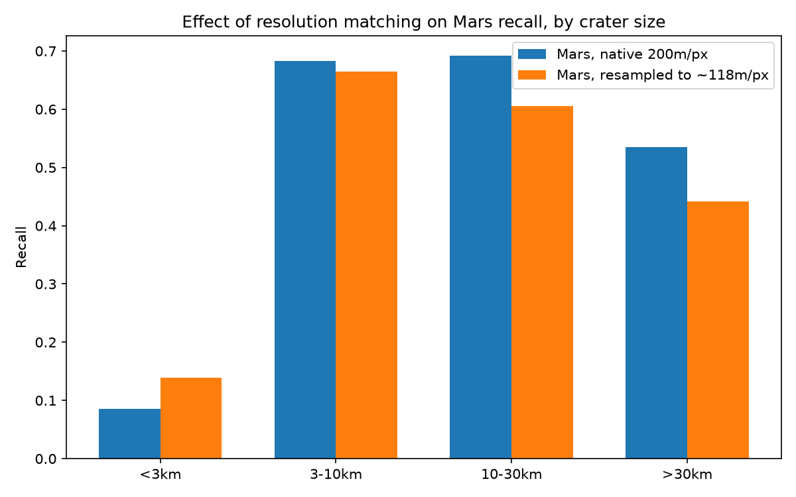
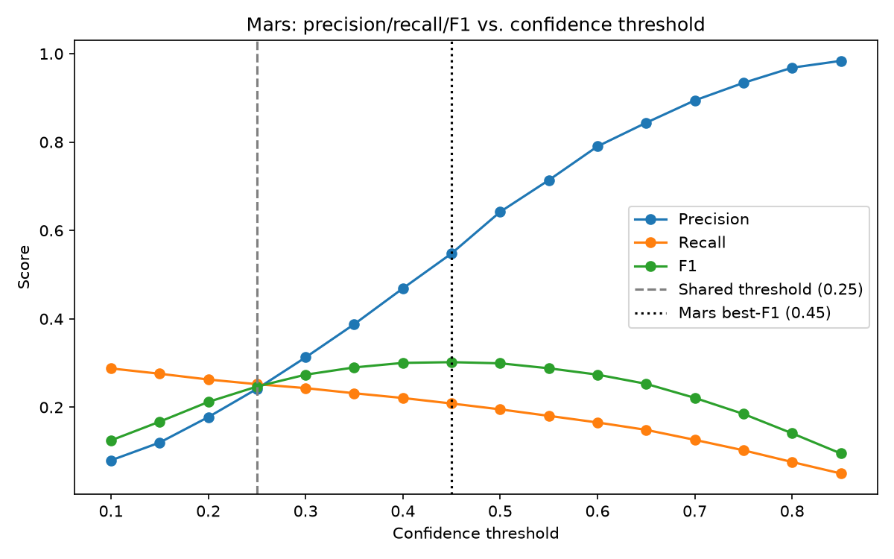

# Planetary Crater Detection: Measuring the Moon-to-Mars Domain Gap

A YOLOv8 crater detector trained entirely on lunar terrain, evaluated zero-shot on Martian
terrain it has never seen. The point of this project isn't building the most accurate crater
detector possible — it's measuring, precisely, how and why detection performance degrades when
a model crosses from one planetary body to another it was never trained on.

License: see [`LICENSE`](LICENSE) · Part of a GeoAI / Remote Sensing portfolio bridging
geography and deep learning.

## Why this project

Crater counting is one of the primary tools planetary scientists use to estimate surface age —
more craters generally means older, less geologically active terrain. Manually cataloguing
craters across an entire planet is infeasible at scale, which is exactly the kind of problem
object detection is suited for. But a detector trained on one planetary body and deployed on
another faces a genuine domain-shift problem: different sensors, different resolutions, and
different geological histories all stand between "detects lunar craters well" and "detects
craters, period." This project trains once, on the Moon only, and treats Mars purely as an
unseen test — then digs into exactly where and why the transfer breaks down.

## Pipeline

| Stage | Folder | What it does |
|---|---|---|
| 1 | [`01_data_acquisition`](01_data_acquisition) | Crops manageable regional DEMs from global LOLA (Moon) and MOLA+HRSC (Mars) mosaics; pulls matching Robbins crater catalogs |
| 2 | [`02_tiling_and_label_generation`](02_tiling_and_label_generation) | Tiles regions into 640x640 [elevation, slope, hillshade] images; converts crater catalogs into YOLO-format bounding boxes |
| 3 | [`03_training`](03_training) | Fine-tunes YOLOv8s on Moon tiles only, on a free-tier Colab T4 |
| 4 | [`04_evaluation`](04_evaluation) | Zero-shot evaluation on Mars; aggregate metrics, size/region/confidence breakdowns |
| 5 | [`05_domain_adaptation`](05_domain_adaptation) | Tests two inference-time fixes for the domain gap, without retraining on Mars |

Each stage folder has its own README with full methodology, gotchas, and exact run
instructions. [`docs/GLOSSARY.md`](docs/GLOSSARY.md) covers every domain-specific and
ML-specific term used across the project, for readers coming from either a geography or an
engineering background.

## Data sources

- **Lunar DEM:** LRO LOLA global mosaic, 118 m/px, USGS Astrogeology.
- **Martian DEM:** MOLA+HRSC blended global mosaic, 200 m/px, USGS Astrogeology — chosen over
  the native 463 m/px MOLA-only product specifically to narrow the resolution gap with the
  lunar data going in.
- **Lunar craters:** Robbins (2019) Lunar Crater Database, ~1.3M craters, complete to ~1-2 km.
- **Martian craters:** Robbins & Hynek (2020 release) Mars Crater Database, complete to ~1 km.

Six regions total, chosen for terrain diversity rather than 1:1 geographic correspondence
between the two bodies: lunar mare plains, lunar heavily-cratered highlands, and lunar polar
terrain; Martian ancient highlands, young volcanic plains, and a degraded impact basin rim.

## Why YOLOv8

Crater diameters in this dataset span roughly two orders of magnitude, from a few pixels to
hundreds, with only one object class to detect. YOLOv8's anchor-free, multi-scale (P3/P4/P5)
detection head handles exactly that combination without needing hand-tuned anchor sizes. Its
PAN-FPN neck fuses fine spatial detail with deep semantic context across scales, which is what
lets the same network catch both a 2 km crater and a 60 km crater. The three terrain channels
([elevation, slope, hillshade], built in Stage 2) drop directly into the network's ordinary
three-channel input slot — no architecture changes needed, since YOLOv8 has no notion that its
input channels are usually color.

## Results

### In-domain baseline (Moon, Stage 3)

Trained YOLOv8s, 150 epochs, on lunar tiles only:

| mAP50 | mAP50-95 | Precision | Recall |
|---:|---:|---:|---:|
| 0.362 | 0.159 | 0.530 | 0.355 |

### Zero-shot transfer to Mars (Stage 4)

| Metric | Moon | Mars | Relative drop |
|---|---:|---:|---:|
| mAP50 | 0.362 | 0.211 | 41.7% |
| mAP50-95 | 0.159 | 0.090 | 43.3% |
| Precision (shared threshold) | 0.687 | 0.242 | 64.8% |
| Recall (shared threshold) | 0.277 | 0.252 | 9.0% |

At a threshold each domain optimizes for itself, precision looks nearly flat between planets.
Forced through the *same* threshold — the only realistic scenario for actual deployment — Mars
precision collapses. That gap between "looks fine" and "actually fine" is itself one of this
project's findings, not just a footnote.



*Elevation shown as a heatmap; green boxes are ground-truth craters, red boxes are model
predictions. Isolated, well-formed craters (top middle, bottom right) transfer almost
perfectly across planets. The two Mars plains/basin tiles (bottom row) show the project's
core failure mode directly: confident red boxes drawn on plain terrain texture with no crater
underneath.*



*Physical diameter, not pixel size, is what's plotted here — converted per body using its
actual ground resolution (118 m/px Moon, 200 m/px Mars), since a fixed pixel threshold means
different real-world sizes on the two planets. Once craters are large enough to be
well-resolved (>3 km), Mars recall matches or beats the Moon's. The entire recall collapse
lives in the smallest bin.*



*mare_procellarum — sparse, well-defined craters on smooth mare basalt — is the strongest
performer on either planet. All three Mars regions cluster in a similar, lower band regardless
of terrain type, arguing this is a planet-wide effect rather than one unusual region.*



*On the Moon, false positives are comparatively rare at every confidence level. On Mars, they
pile up at the low-to-moderate end of the range — the network is producing plausible confidence
scores for spurious detections on terrain it never saw during training, which is a calibration
failure distinct from the recall story above.*

Full PR curves for each domain: [`04_evaluation/eval_sets/moon_val/PR_curve.png`](04_evaluation/eval_sets/moon_val/PR_curve.png),
[`04_evaluation/eval_sets/mars_val/PR_curve.png`](04_evaluation/eval_sets/mars_val/PR_curve.png).

### Domain adaptation experiments (Stage 5)

Two evidence-backed fixes, tested without retraining on Mars data (which would defeat the
point of a zero-shot test):



*Bicubic-upsampling Mars tiles to the Moon's effective resolution before inference. The
smallest bin's recall did rise (0.085 → 0.139) as the resolution hypothesis predicted, but
every other bin got worse, and false positives on the smallest bin nearly tripled. Upsampling
interpolates existing pixels rather than recovering real detail — a partial, honest result
rather than a clean fix.*



*Mars's own best-F1 operating point sits at confidence 0.45, not the shared 0.25 used
elsewhere in this project. Moving to it more than doubles precision (0.242 → 0.548) for a
modest recall cost, a ~22% F1 improvement, with zero retraining. This is the one intervention
in Stage 5 that produced an unambiguous win.*

## Key findings

1. **Crater shape recognition transfers across planets reasonably well.** The failure mode is
   not "the model doesn't recognize Martian craters as craters" — well-resolved craters detect
   at comparable or better rates on Mars than the Moon.
2. **The recall gap is concentrated almost entirely in small craters (<3 km)** and is consistent
   with a resolution/sampling effect: the same physical crater simply occupies fewer pixels at
   Mars's coarser 200 m/px scale than the model learned to expect from 118 m/px lunar training.
3. **The precision gap is a distinct, separate problem: confidence miscalibration**, not
   inherited from the recall story. The model's confidence scores don't carry the same meaning
   on Mars as they do on the Moon.
4. **Of the two fixes tested, only one worked cleanly.** Per-domain threshold calibration is a
   free, real improvement. Naive resolution-matching is not — it trades a small recall gain in
   one size bin for measurably worse performance everywhere else.

## Reproducing this project

Each stage's own README has exact setup and run steps. In short: Stages 1-2 and 4-5 run
locally (no GPU required — they're I/O, geometry, and CPU-scale inference); Stage 3 (training)
runs on a free-tier Colab T4. Google Drive is used only to move the two trained checkpoints
(`latest.pt`, `best.pt`) between the two environments — the dataset itself never needs to leave
your machine except as tiled PNGs for training.

## Repository structure

```
Planetary-Crater-Detection/
├── 01_data_acquisition/
├── 02_tiling_and_label_generation/
├── 03_training/
├── 04_evaluation/
├── 05_domain_adaptation/
├── docs/
│   └── GLOSSARY.md
├── LICENSE
└── README.md
```

## License

See [`LICENSE`](LICENSE).

## Author

Tamojeet Pal ([@iTamojeet](https://github.com/iTamojeet))

